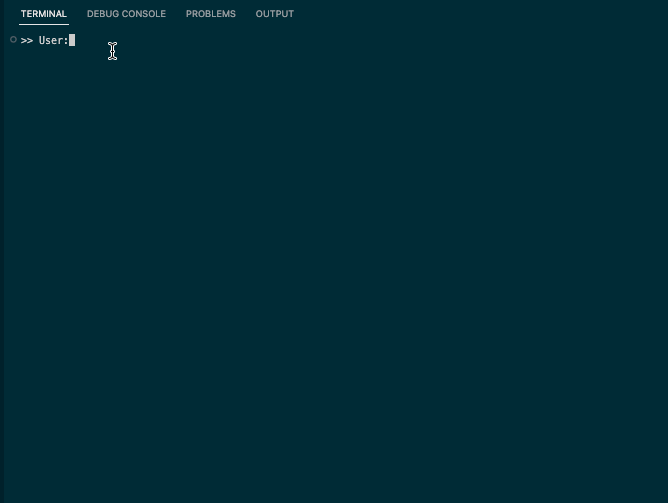

# terminal chatbot

## This is only for tinkering

This simple python chatbot uses Hugging Face's transformers library and PyTorch to encode user input, pass it with chat history to microsoft/DialoGPT-medium to generate a response, then decodes the response to the terminal.

  

## Running the chatbot locally
In the directory, run `python chatBot.py`
