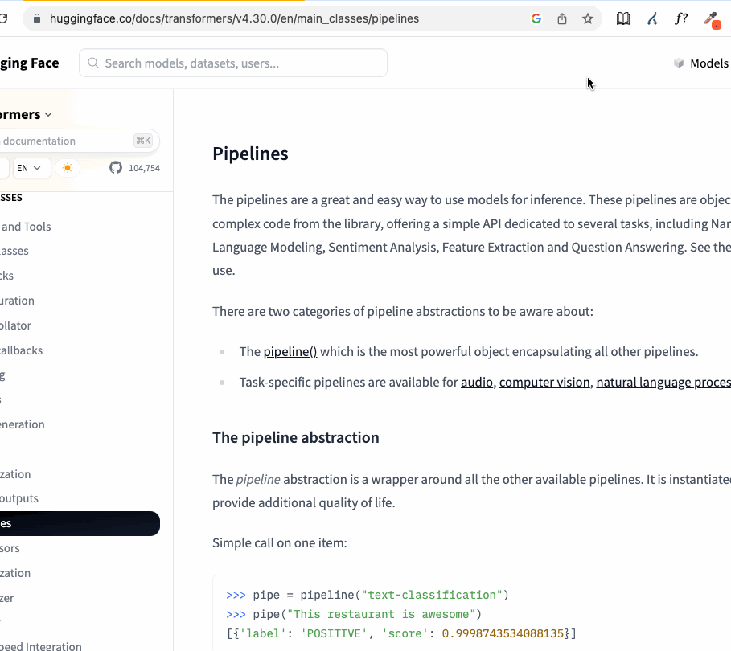

# Summarizer

## This is a play project to tinker around with

Open Summarizer on a webpage and get a summary of its content. The summarizer is powered by by Hugging Face's inference API and the facebook/bart-large-cnn model for text summarization. Since this is a simple play project that runs in a browser, I've left an empty string where the Hugging Face API key needs to go in background.js. It won't work unless you paste yours in.

  

## Running Summarizer locally
1. Navigate to chrome://extensions/
2. In the upper right, toggle on Developer Mode
3. In upper left, select Load Unpacked
4. Select the summarizer_bart-large-cnn_chrome_extension directory
